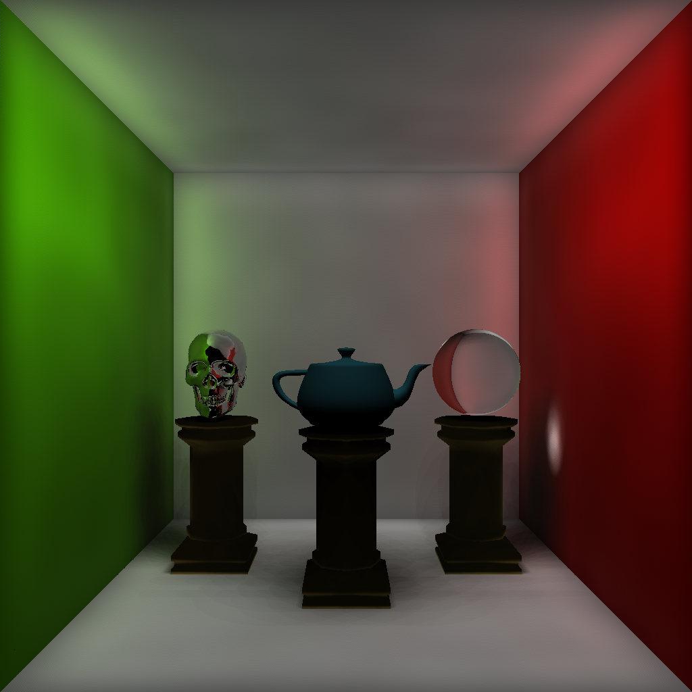

# Ray Tracing Image Renderer
## *Coursework project for a university unit*

In this coursework project I have created a ray tracing based image renderer. 
Some basic shading and lighting components were programmed: Phong shading, reflection, refraction, shadows, and smooth shading using barycentric coordinates.
On top of this photon mappping (based on [this](http://graphics.ucsd.edu/~henrik/papers/ewr7/global_illumination_using_photon_maps_egwr96.pdf) paper) was implemented to improve global illumination.
The render below is an image created with all those techniques implemented.

Please refer to the *Report.pdf* document for more information.

### Repository Structure

`Alglib`: Folder containing a dependency.

`CPP Files`: Implemented class files.

`Header Files`: Headers, imported into CPP files.

`ply_files`: Polygon objects used in the final render.

`Report.pdf`: A report outlining the implementation of this project.

`test.sh`: A shell script to compile and run the files. Warning: if you intend to run them, consider using OpenMP or another parallelization framework, otherwise this will take a long time to run. This code has been prepared to use OpenMP (look for the `#pragma` statements in `image_generator.cpp`).

### Dependencies
* Alglib (included)
* gcc